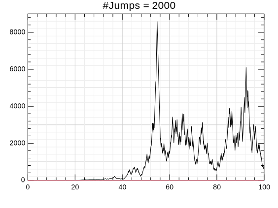

# PDMP

[](https://travis-ci.org/sdwfrost/Gillespie.jl)

This is an implementation of the [True Jump Method method](http://arxiv.org/abs/1504.06873) for performing stochastic simulations of Piecewise Deterministic Markov Processes (PDMP) also called hybrid systems.

A rejection method will be added soon.

An example of a TCP process:

```julia
using PDMP

function F_tcp(xcdot, xc, xd, t, parms )
  # vector field used for the continuous variable
  if mod(xd[1],2)==0
    xcdot[1] = xc[1]
  else
    xcdot[1] = -xc[1]
  end
  nothing
end

function R_tcp(xc, xd, t, parms, sum_rate::Bool)
  # rate function
  if sum_rate==false
    return vec([5.0/(1.0 + exp(-xc[1]/1.0 + 5.0)) + 0.1, parms[1]]/(1.0 + exp(-xc[1]/1.0 + 5.0)) + 0.1)
  else
    return 5.0/(1.0 + exp(-xc[1]/1.0 + 5.0)) + 0.1 + parms[1]/(1.0 + exp(-xc[1]/1.0 + 5.0)) + 0.1
  end
end

function Delta_xc_tcp(xc, xd, t, parms, ind_reaction::Int64)
	# jump on the continuous variable
  return vec([0.])
end


xc0 = vec([0.05])
xd0 = vec([0, 1])

const nu_tcp = [[1 0];[0 -1]]
parms = [0.]
tf = 2000.

dummy =  PDMP.chv(2,xc0,xd0,F_tcp,R_tcp,Delta_xc_tcp,nu_tcp,parms,0.0,tf,false)
result =  @time PDMP.chv(2000,xc0,xd0,F_tcp,R_tcp,Delta_xc_tcp,nu_tcp,parms,0.0,tf,false)

println("#jumps = ", length(result.time))

using GR
GR.inline()
ind = find(result.time.<49)
GR.plot(result.time[ind],result.xc[1,:][ind],"k",result.time[ind],result.xd[1,:][ind],"r",title = string("#Jumps = ",length(result.time)))
```



Passing functions as arguments in Julia (currently) incurs a performance penalty. One can circumvent this by passing an immutable object, with ```call``` overloaded. An example of this approach is given [here](https://).
